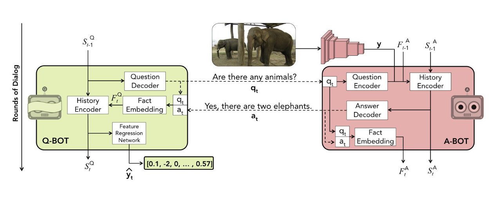
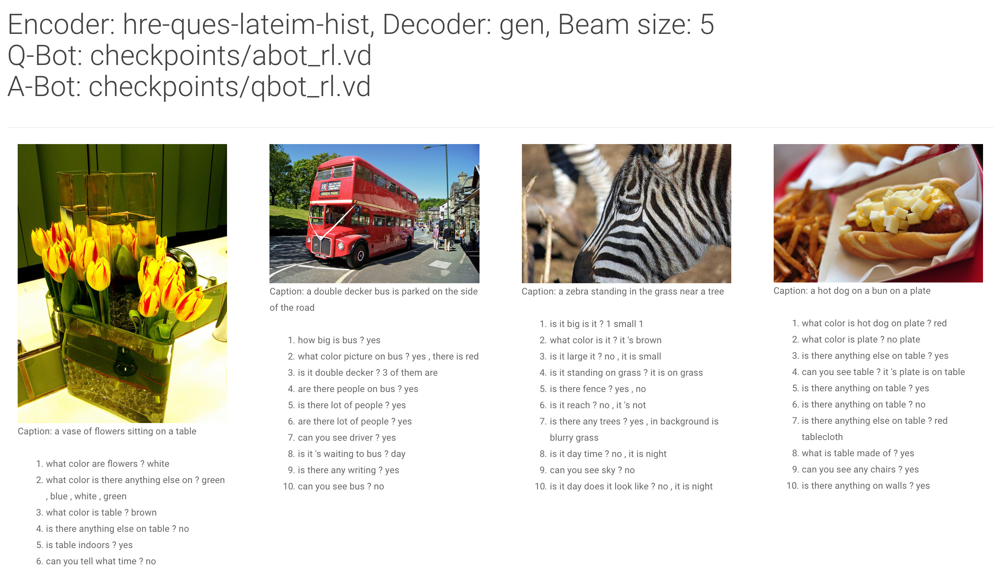

# Visdial-RL-PyTorch

PyTorch implementation of the paper:

**[Learning Cooperative Visual Dialog Agents with Deep Reinforcement Learning](https://arxiv.org/abs/1703.06585)**  
Abhishek Das*, Satwik Kottur*, José Moura, Stefan Lee, and Dhruv Batra  
<https://arxiv.org/abs/1703.06585>  
ICCV 2017 (Oral)  

Visual Dialog requires an AI agent to hold a meaningful dialog with humans in natural, conversational language about visual
content. Given an image, dialog history, and a follow-up question about the image, the AI agent has to answer the question.

This repository contains code for training the **questioner** and **answerer** bots described in the paper, in both **supervised** fashion and via **deep reinforcement learning** on the Visdial 0.5 dataset for the cooperative visual dialog task of _GuessWhich_.   



Table of Contents
=================

   * [Setup and Dependencies](#setup-and-dependencies)
   * [Usage](#usage)
      * [Preprocessing VisDial](#preprocessing-visdial)
      * [Extracting image features](#extracting-image-features)
      * [Download preprocessed data](#download-preprocessed-data)
      * [Pre-trained checkpoints](#pre-trained-checkpoints)
      * [Demo](#demo)
      * [Training](#training)
      * [Evaluation](#evaluation)
      * [Logging](#logging)
      * [Benchmarks](#benchmarks)
   * [Visualizing Results](#visualizing-results)
   * [Reference](#reference)
   * [License](#license)

## Setup and Dependencies

Our code is implemented in PyTorch (v0.3.1). To setup, do the following:

1. Install [Python 3.6](https://www.python.org/downloads/release/python-365/)
2. Install [PyTorch](https://pytorch.org/) v0.3.1, preferably with CUDA – running with GPU acceleration is highly recommended for this code. Note that PyTorch 0.4 is not supported.
3. If you would also like to extract your own image features, install [Torch](http://torch.ch/), [torch-hdf5](https://github.com/deepmind/torch-hdf5), [torch/image/](https://github.com/torch/image), [torch/loadcaffe/](https://github.com/szagoruyko/loadcaffe), and optionally [torch/cutorch/](https://github.com/torch/cutorch), [torch/cudnn/](https://github.com/soumith/cudnn.torch), and [torch/cunn/](https://github.com/torch/cunn) for GPU acceleration. Alternatively, you could directly use the precomputed features provided below.
4. Get the source:
```
git clone https://github.com/batra-mlp-lab/visdial-rl-pytorch.git visdial-pytorch
```
5. Install requirements into the `visdial-rl-pytorch` virtual environment, using [Anaconda](https://anaconda.org/anaconda/python):
```
conda env create -f env.yml
```

## Usage

Preprocess data using the following scripts OR directly download preprocessed data [below](#download-preprocessed-data).

### Preprocessing VisDial

Download and preprocess VisDial as described in the [visdial](https://github.com/batra-mlp-lab/visdial.git) repo.
Note: This requires [Torch](http://torch.ch/) to run. Scroll down further if you would like to directly use precomputed features.

```
cd data/
python prepro.py -version 0.5 -download 1

# To process VisDial v0.9, run:
# python prepro.py -version 0.9 -download 1 -input_json_train visdial_0.9_train.json \
#                                           -input_json_val visdial_0.9_val.json

cd ..

```

This will generate the files `data/visdial/chat_processed_data.h5` (containing tokenized captions, questions, answers, and image indices), and `data/visdial/chat_processed_params.json` (containing vocabulary mappings and COCO image ID's).

### Extracting image features

To extract image features using VGG-19, run the following:

```
sh data/download_model.sh vgg 19
cd data

th prepro_img_vgg19.lua -imageRoot /path/to/coco/images -gpuid 0

```
Similary, to extract features using [ResNet](https://github.com/facebook/fb.resnet.torch/tree/master/pretrained), run:

```
sh data/download_model.sh resnet 200
cd data
th prepro_img_resnet.lua -imageRoot /path/to/coco/images -cnnModel /path/to/t7/model -gpuid 0
```

Running either of the above will generate `data/visdial/data_img.h5` containing features for COCO `train` and `val` splits.

### Download preprocessed data

Download preprocessed dataset and extracted features:

```
sh scripts/download_preprocessed.sh
```

### Pre-trained checkpoints

Download pre-trained checkpoints:

```
sh scripts/download_checkpoints.sh
```

### Demo

A demo of inference for question and answer generation is available in [inference.ipynb](inference.ipynb).

### Training

The model definitions supported for training models are included in the `models/` folder -- we presently support the `hre-ques-lateim-hist` encoder with `generative` decoding.

The arguments to `train.py` are listed in `options.py`. There are three training modes available - `sl-abot`, `sl-qbot` for supervised learning (pre-training) of A-Bot and Q-Bot respectively, and `rl-full-QAf` for RL fine-tuning of both A-Bot and Q-Bot beginning from specified SL pre-trained checkpoints. `full-QAf` denotes that all components of each agent (dialog component and/or image prediction component) are fine-tuned.

For supervised pre-training:

```
python train.py -useGPU -trainMode sl-abot
```

For RL fine-tuning:

```
python train.py -useGPU \
   -trainMode rl-full-QAf \
   -startFrom checkpoints/abot_sl_ep60.vd \
   -qstartFrom checkpoints/qbot_sl_ep60.vd
```


### Evaluation


The three types of evaluation - (1) ranking A-Bot's answers, (2) ranking Q-Bot's image predictions and (3) ranking Q-Bot's predictions when interacting with an A-Bot, are arguments `QBotRank`, `ABotRank` and `QABotsRank` respectively to `evalMode`. Any subset of them can be given as a list to `evalMode`.

For evaluation of Q-Bot on image guessing and A-Bot on answer ranking on human-human dialog (ground truth captions, questions and answers), the following command can be used:

```
python evaluate.py -useGPU \
    -startFrom checkpoints/abot_sl_ep60.vd \
    -qstartFrom checkpoints/qbot_sl_ep60.vd \
    -evalMode ABotRank QBotRank
```

For evaluation of Q-Bot on image guessing when interacting with an A-Bot, the following command can be used. Since no human-human dialog (ground truth) is shown to the agents at this stage, ground truth captions are not used. Instead, captions need to be read from `chat_processed_data_gencaps.h5`, which contains preprocessed captions generated from [neuraltalk2](https://github.com/karpathy/neuraltalk2). This file provides the VisDial 0.5 test split where original ground truth captions are replaced by generated captions.

```
python evaluate.py -useGPU \
    -inputQues data/visdial/chat_processed_data_gencaps.h5 \
    -startFrom checkpoints/abot_sl_ep60.vd \
    -qstartFrom checkpoints/qbot_sl_ep60.vd \
    -evalMode QABotsRank
```

### Logging

The code supports logging several metrics via [visdom](https://github.com/facebookresearch/visdom). These include train and val loss curves, VisDial metrics (mean rank, reciprocal mean rank, recall@1/5/10 for the answerer, and percentile mean rank for the questioner). To enable visdom logging, use the `enableVisdom` option along with other visdom server settings in `options.py`. A standalone visdom server can be started using:

```
python -m visdom.server -p <port>
```

Now you can navigate to `localhost:<port>` on your local machine and select the appropriate environment from the drop down to visualize the plots. For example, if I want to start a `sl-abot` job which logs plots by connecting to the above visdom server (hosted at `localhost:<port>`), the following command may be used to create an environment titled `my-abot-job`

```
python train.py -useGPU \
    -trainMode sl-abot \
    -enableVisdom 1 \
    -visdomServer http://127.0.0.1 \
    -visdomServerPort <port> \
    -visdomEnv my-abot-job
```

### Benchmarks

Here are some benchmarked results for both Agents on the VisDial 0.5 test split.

**Questioner**

The plots below show percentile mean rank (PMR) numbers obtained on evaluating the questioner for the SL-pretrained and RL-full-QAf settings, when evaluated on generated dialog (with the two agents interacting with each other along with being provided a generated caption instead of ground truth) based image retrieval.

We have also experimented with other hyperparameter settings and found that scaling the cross entropy loss lead to a significant improvement in PMR. Namely, setting `CELossCoeff` to `1` and `lrDecayRate` to `0.999962372474343` lead to the PMR values shown on the right. The corresponding pre-trained checkpoints are available for download and are denoted by a `_delta` suffix.

Note that RL fine tuning begins with annealing i.e. the RL objective is gradually eased in from the last round (round 10) to the first round of dialog. Every epoch after the first one begins be decreasing the number of rounds for which supervised pre-training is used. The following plots show the RL-Full-QAf model results at epoch 10 (when annealing ends) as well as epoch 20.

Note that RL fine tuning begins with annealing i.e. the RL objective is gradually eased in from the last round (round 10) to the first round of dialog. Every epoch after the first one begins be decreasing the number of rounds for which supervised pre-training is used. The following plots show the RL-Full-QAf model results at epoch 10 (when annealing ends) as well as epoch 20 (10 epochs of only RL)

<div align=center>
  
  
</div>

**Answerer**

The table below shows evaluation performance of the trained answerer on the VisDial answering metrics. These metrics measure the answer retrieval performance of the A-Bot given image, human-human (ground truth) dialog and ground truth caption as input. Note that the epoch number is consistent across A-Bot and Q-Bot. The SL-pretraining epoch denotes the checkpoint from which the corresponding RL-finetuning was started.

|  Checkpoint | Epoch |   MR  |  MRR  |   R1  |   R5  |  R10  |
|:-----------:|:-----:|:-----:|:-----:|:-----:|:-----:|:-----:|
| SL-Pretrain |   60  | 21.94 | 0.432 | 33.21 | 52.67 | 59.23 |
| RL-Full_QAf |   10  | 21.63 | 0.434 | 33.29 | 53.10 | 59.70 |
| RL-Full-QAf |   20  | 21.58 | 0.433 | 33.22 | 53.09 | 59.64 |

Similar as above, we find better performance for the Δ (Delta) hyperparameter setting (which downscales scales the cross entropy loss).

|     Checkpoint    | Epoch |   MR  |  MRR  |   R1  |   R5  |  R10  |
|:-----------------:|:-----:|:-----:|:-----:|:-----:|:-----:|:-----:|
| SL-Pretrain-Delta |   15  | 21.02 | 0.434 | 33.02 | 53.51 | 60.45 |
| RL-Full_QAf-Delta |   10  | 21.61 | 0.410 | 30.38 | 51.61 | 59.30 |
| RL-Full-QAf-Delta |   20  | 22.80 | 0.377 | 26.64 | 49.48 | 57.46 |

### Visualizing Results

To generate dialog for visualization, run `evaluate.py` with `evalMode` set to `dialog`.

```
python evaluate.py -useGPU \
    -startFrom checkpoints/abot_rl_ep20.vd \
    -qstartFrom checkpoints/qbot_rl_ep20.vd \
    -evalMode dialog \
    -beamSize 5
```

This generates a json file `dialog_output/results/results.json`. Now to visualize the generated dialog, run:
```
cd dialog_output/
python -m http.server 8000
```

Navigate to `localhost:8000` in your browser to see the results! The page should look as follows.



## Reference

If you use this code as part of any published research,  please cite this repo as well as Das and Kottur et. al., Learning Cooperative Visual Dialog Agents with Deep Reinforcement Learning.

```
@misc{modhe2018visdialrlpytorch
   author = {Modhe, Nirbhay and Prabhu, Viraj and Cogswell, Michael and Kottur, Satwik and Das, Abhishek and Lee, Stefan and Parikh, Devi and Batra, Dhruv },
   title = {VisDial-RL-PyTorch},
   year = {2018},
   publisher = {GitHub}.
   journal = {GitHub repository},
   howpublished = {\url{https://github.com/batra-mlp-lab/visdial-rl.git}}
 }

@inproceedings{das2017visdialrl,
  title={Learning Cooperative Visual Dialog Agents with Deep Reinforcement Learning},
  author={Abhishek Das and Satwik Kottur and Jos\'e M.F. Moura and
    Stefan Lee and Dhruv Batra},
  booktitle={Proceedings of the IEEE International Conference on Computer Vision (ICCV)},
  year={2017}
}
```

## Acknowledgements

We would like to thank [Ayush Shrivastava](https://github.com/ayshrv) for his help with testing this codebase.

## License

BSD
